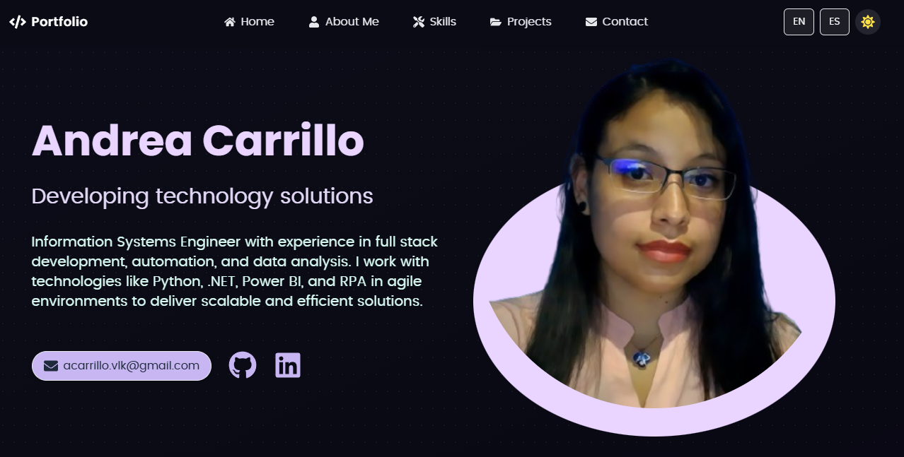

# 🌐 Personal Portfolio – Andrea Carrillo Oporto

Welcome to my personal portfolio 👩‍💻 built with **React**, **Vite**, and **Tailwind CSS**, featuring **light/dark mode** and **internationalization**. This site showcases my experience, skills, and highlighted projects as an aspiring software developer.

## ✨ Features

- ⚛️ **React + Vite**: Modern, fast, and modular architecture.
- 🎨 **Custom pastel theme**: Warm and professional tones (celeste and pink).
- 🌗 **Dark/Light mode**: Seamlessly adapts to user preference.
- 🌍 **Multilingual support**: English and Spanish via `react-i18next`.
- 🧩 **Reusable components**: Modular structure (`Section`, `WaveDivider`, `BlurBlob`, etc.).
- 🌀 **Smooth transitions** and animated decorative blobs.
- 📱 **Fully responsive**: Optimized for all screen sizes.

## 🖼️ Preview




## ⚙️ Technologies Used

| Tech             | Description                          |
| ---------------- | ------------------------------------ |
| ⚛️ React         | Core UI library                      |
| ⚡ Vite          | Lightning-fast development bundler   |
| 🎨 Tailwind CSS  | Utility-first styling framework      |
| 🌍 react-i18next | Translation and localization support |
| 🌗 Dark Mode     | Toggle via Tailwind `class="dark"`   |
| 💠 FontAwesome   | Clean, professional icons            |

## 📁 Folder Structure

```
src/
├── assets/         # Images and static content
├── components/     # Reusable React components
├── constants.js    # Centralized metadata (links, skills, etc.)
├── i18n/           # Language translation files
├── App.jsx         # Main app component
├── main.jsx        # App entry point
└── index.css       # Tailwind + base styles
```

## 🚀 Getting Started

```bash
# Clone the repository
git clone https://github.com/yourusername/portfolio.git
cd portfolio

# Install dependencies
npm install

# Start the development server
npm run dev
```

## 🧑‍🎨 Customization

You can easily update:

- 🎨 Colors in `tailwind.config.js`
- 🌐 Languages in `src/i18n/locales/`
- 💡 Skills & projects in `src/constants.js`
- 📸 Profile image in `src/assets/avatar/avatar.jpg`

## ☁️ Deployment

This project was deployed using [Vercel](https://vercel.com).  
You can visit the live site at: 🔗 [https://portfolio.vercel.app](https://portfolio-two-pied-24.vercel.app)

---

> Developed with 💙 pastel tones and ☕ by Andrea Carrillo Oporto
